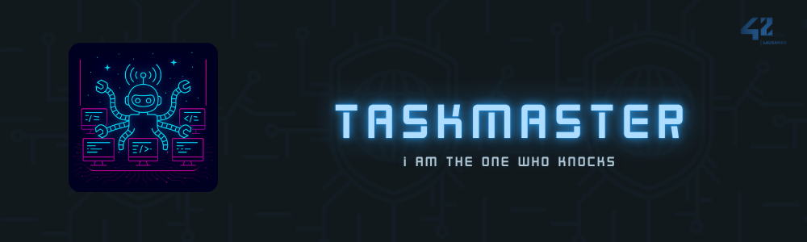

<br>

# taskmaster — 42

Daemon de gestion et supervision de processus asynchrone écrit en Python 3, inspiré de Supervisor. Taskmaster permet de démarrer, arrêter, redémarrer et monitorer des services avec des capacités avancées de reconfiguration, reloadable à chaud via SIGHUP.

<br>

## Description

Taskmaster est un daemon de supervision de processus conçu pour gérer plusieurs services enfants avec granularité. Chaque service peut avoir plusieurs instances parallèles (via `numprocs`). Le système fournit un shell interactif de contrôle avec des commandes pour gérer l'état des services, et un système de monitoring continu qui détecte les crashs et redémarrage selon les stratégies configurées (`autorestart: always|never|unexpected`).  
Les services sont configurables via fichiers YAML avec support pour : variables d'environnement personnalisées, redirection des flux stdout/stderr, contrôle d'utilisateur, signaux d'arrêt personnalisés, masques `umask`, répertoires de travail isolés, et codes de sortie attendus. La configuration peut être rechargée à chaud sans redémarrage global via la commande `reload` ou signal `SIGHUP`.

### Architecture

**ServiceHandler** : Orchestrateur central combinant trois mixins pour la gestion complète du cycle de vie (`LifecycleMixin`), monitoring continu (`MonitorMixin`), et reconfiguration dynamique (`ReloadMixin`).  
**Service** : Classe encapsulant un processus enfant avec gestion asynchrone du démarrage/arrêt gracieux.  
**ServiceMonitor** : Boucle de monitoring asynchrone détectant les crashs et appliquant la logique de redémarrage.  
**ControlShell** : Interface interactive non-bloquante avec support readline pour la saisie des commandes utilisateur.  
**Config** : Chargeur YAML avec validation stricte Cerberus, supportant deux formats de configuration (programmes ou services).  

### Caractéristiques techniques

- **Asynchrone** : Entièrement asyncio, sans threads  
- **Monitoring intelligent** : Détecte crashs précoces, attentes de stabilité (starttime), dépassements de limites de redémarrage  
- **Gestion multi-instances** : Chaque service peut spawner N processus parallèles via `numprocs`  
- **Graceful shutdown** : Arrêt progressif avec signal configurable (TERM/KILL/USR1/USR2/etc.) et timeout  
- **Validation stricte** : Cerberus schema garantissant l'intégrité des configurations  
- **Isolation** : Chaque processus enfant dans son propre session group pour un arrêt propre  
- **Logging complet** : Timestampé en fichier avec rotation, séparation console/fichier  
- **Signaux système** : SIGINT (shutdown), SIGHUP (reload), SIGTERM (stop)  

<br>

## Utilisation

Voici les différentes étapes pour utiliser et tester Taskmaster avec Docker et les fichiers de configuration YAML fournis.

1. Préparer l'environnement Docker

```bash
docker-compose up -d --build
docker exec -it taskmaster bash
python3 -m venv ./venv
source ./venv/bin/activate
pip install -r ./requirements.txt
```

<br>

2. Lancer et superviser les processus

a. Lancer un fichier de test

```bash
python3 -m taskmaster -f tests/01_test_child.yaml
```

b. Vérifier les PID

```bash
ps aux | grep taskmaster | grep -v grep
ps aux | grep "sleep 300" | grep -v grep
ps -o pid,ppid,cmd -p <PID_CMD_3>
```

<br>

3. Garder les processus enfants actifs et les redémarrer

```bash
python3 -m taskmaster -f tests/02_keep_child_processes_alive_and_restart.yaml
```
> Vérifiez les logs pour voir si le processus enfant tourne et redémarre plusieurs fois.

<br>

4. Vérifier l'état des processus

Dans un terminal :

```bash
python3 -m taskmaster -f tests/03_processes_are_alive_or_dead.yaml
status
```

Dans un autre terminal :

```bash
ps aux | grep "sleep 300"
kill -9 <PID>
```

Retournez au premier terminal :

```bash
status
```

<br>

5. Recharger la configuration à chaud

```bash
python3 -m taskmaster -f tests/04_loaded_at_launch_and_must_be_reloadable.yaml
```
> Preuve de lancement : vérifiez le fichier de logs.

Modifiez le fichier YAML pour ajouter un service, puis :

```bash
reload
```
> Deux services devraient maintenant tourner.

<br>

6. Modifier les conditions de supervision

```bash
python3 -m taskmaster -f tests/05_changing_their_monitoring_conditions.yaml
```
Actions à effectuer dans le YAML :
- `startretries: 5`
- `exitcodes: [0,1]`
- `autorestart: always`

<br>

7. Modification d’un service sans respawn global

```bash
python3 -m taskmaster -f tests/06_not_de_spawn.yaml
```
Dans le YAML, modifiez :

```yaml
modified_service:
  cmd: /bin/sleep 100
```

Puis :

```bash
reload
```
> Vérifiez dans les logs que seul le service modifié a changé de PID.

<br>

8. Arrêt contrôlé (stop time)

```bash
python3 -m taskmaster -f tests/07_stoptime_validation.yaml
stop stoptime_2sec
stop stoptime_5sec
stop stoptime_10sec
```
> Vérifiez que le temps d’arrêt correspond à la configuration.

<br>

9. Redirection stdout & stderr

```bash
python3 -m taskmaster -f tests/08_stdout_stderr_redirect.yaml
cat /tmp/taskmaster_stdout.log
cat /tmp/taskmaster_stderr.log
cat /tmp/taskmaster_combined.log
cat /tmp/taskmaster_only_stderr.log
grep "This should disappear" /tmp/taskmaster_only_stderr.log
```

<br>

10. Variables d’environnement

```bash
python3 -m taskmaster -f tests/09_env.yaml
cat /tmp/demo_env_output.log
```

<br>

11. Répertoire de travail

```bash
python3 -m taskmaster -f tests/10_workingdir.yaml
cat /tmp/demo_workdir_output.log
ls /tmp/demo_file.txt
```

<br>

12. Umask

```bash
python3 -m taskmaster -f tests/11_umask.yaml
ls -la /tmp/fichier_*.txt
echo "TEST" > /tmp/fichier_normal.txt
cat /tmp/fichier_normal.txt
echo "Attempt" > /tmp/fichier_readonly.txt
```

<br>

## Choix d'implémentation

**Asyncio pur** : Choix de l'asynchrone sans threads pour éviter les race conditions et simplifier la gestion concurrente.  
**Mixins** : Séparation logique du code (lifecycle/monitoring/reload) pour maintenabilité et testabilité.  
**Lock asynchrone** : Protège les modifications d'état des services contre les race conditions entre shell et monitoring.  
**Détection d'early-exit** : Distinction entre crashs pendant starttime vs après stabilisation pour une logique de redémarrage appropriée  
**Validation Cerberus** : Permet une validation déclarative stricte avec messages d'erreur explicites.  
**Session group** : Chaque processus dans sa propre session permet un arrêt atomique de tous les descendants.  
**Reload atomique** : Les modifications (ajout/suppression/update) appliquées en bloc sous lock pour cohérence garantie.  
**Umask octal** : Support natif octal (0o22) et string avec normalisation interne.

<br>

## Liens utiles

- [Sujet officiel](./utils/subject.pdf)
- [Feuille d'évaluation](./utils/eval.pdf)

<br>

## Grade

> En attente d'évaluation

<br>

## Auteurs

<table>
	<tr>
		<td align="center">
			<a href="https://github.com/cduffaut" target="_blank">
				<br>
				<b>Cécile</b>
			</a>
		</td>
		<td align="center">
			<a href="https://github.com/aceyzz" target="_blank">
				<br>
				<b>Cédric</b>
			</a>
		</td>
	</tr>
</table>